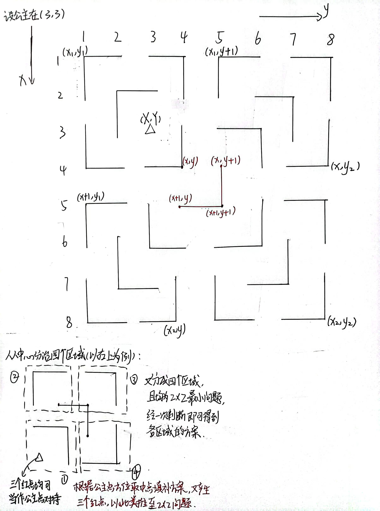

#! https://zhuanlan.zhihu.com/p/594534245

# 算法(Algorithm)
## 分治
### 例题
#### 洛谷 P1228 地毯填补问题
##### 题意：寻求一组能填补除给定点外其他地方的方案。
* 大问题分为四个区域，最小问题为 2 X 2 问题，其中最小问题需要依据 公主点(特殊点)来确定地毯形状。唯一公主点 只会在其中一个区域，我们以 唯一公主点 确认中心地毯(x, y)的对角方位;
* 得到(x, y)后，其所占用的点就是其他三个区域的特殊点(视为公主点)；
* 可以通过 2x2 -> 4x4 -> n*n 递推得到整体解法：先看 4x4 方格，正中间点旁边的3个白色格子都填上同一种颜色，给每个 2×2 的格子都增加一个特殊点，然后再分别处理三个 2×2 的格子就行了;
* 注意，最中间留空处区域的方向就是公主点所在区域。



```cpp
//理解版:
#include <cstdio>
int k, n = 1;
#define pf(a, b, id) {printf("%d %d %d\n", a, b, id);}
void dfs(int x1, int y1, int x2, int y2, int X, int Y)
{
    if(x2 - x1 + 1 == 2 && y2 - y1 + 1 == 2)//此时为最小问题 2x2 问题，依据特殊点位置即可输出对应方案
    {
        if(X == x1 && Y == y1) pf(x2, y2, 1);//特殊点位置在左上角，对角使用地毯方案 1
        if(X == x1 && Y == y2) pf(x2, y1, 2);//右上角
        if(X == x2 && Y == y1) pf(x1, y2, 3);//左下角
        if(X == x2 && Y == y2) pf(x1, y1, 4);//右下角
        return;
    }
    int x = ((x2 - x1 + 1) >> 1) + (x1 - 1);//取中点(x, y)分治
    int y = ((y2 - y1 + 1) >> 1) + (y1 - 1);
    //据 公主点\特殊点 (X, Y)的方位分治
    if(X <= x && Y <= y)//公主位于左上区域
    {
        pf(x + 1, y + 1, 1);
        dfs(x1, y1, x, y, X, Y);//左上区域，亦是公主点区域
        //以(x+1, y+1)点的地毯方案，其上三个点分别视作特殊点，继续分治其他三个区域，每个区域都用左上角点与右下角点框选
        dfs(x + 1, y1, x2, y, x + 1, y);//左下区域
        dfs(x + 1, y + 1, x2, y2, x + 1, y + 1);//右下区域
        dfs(x1, y + 1, x, y2, x, y + 1);//右上区域
    }
    if(X <= x && Y > y)//右上
    {
        pf(x + 1, y, 2);
        dfs(x1, y + 1, x, y2, X, Y);//右上区域，公主点区域
        dfs(x1, y1, x, y, x, y);//左上区域
        dfs(x + 1, y1, x2, y, x + 1, y);//左下区域
        dfs(x + 1, y + 1, x2, y2, x + 1, y + 1);//右下区域
    }
    if(X > x && Y <= y)//左下
    {
        pf(x, y + 1, 3);
        dfs(x + 1, y1, x2, y, X, Y);//左下，公主点
        dfs(x1, y1, x, y, x, y);//左上区域
        dfs(x1, y + 1, x, y2, x, y + 1);//右上区域
        dfs(x + 1, y + 1, x2, y2, x + 1, y + 1);//右下区域
    }
    if(X > x && Y > y)//右下
    {
        pf(x, y, 4);
        dfs(x + 1, y + 1, x2, y2, X, Y);//右下，公主点        
        dfs(x1, y1, x, y, x, y);//左上区域
        dfs(x1, y + 1, x, y2, x, y + 1);//右上区域
        dfs(x + 1, y1, x2, y, x + 1, y);//左下区域
    }
}
int main()
{
    int X, Y;
    scanf("%d%d%d", &k, &X, &Y);
    n <<= k;//获取边长
    dfs(1, 1, n, n, X, Y);
    return 0;
}
```